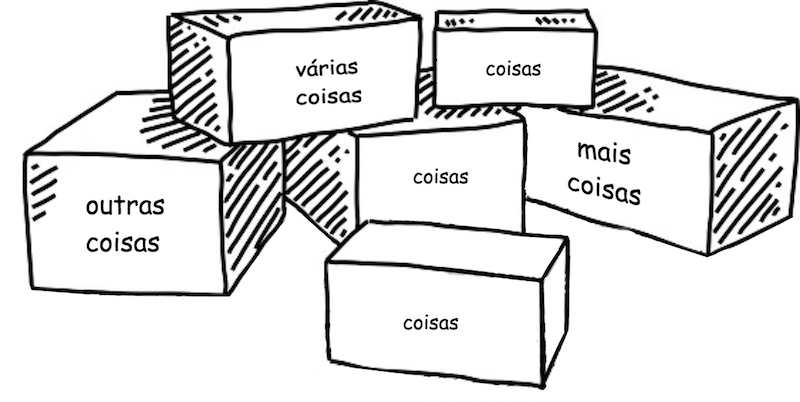

# 2. Representando dados
<br>

## Tipos de dados

Identificar a melhor forma de representar uma informação é uma etapa importante na elaboração de um programa.

Tipos de dados são categorias para essas informações, e cada dado tem exatamente um tipo. Em Python, os tipos básicos de dados são:

| Tipo | Representação | Exemplo |
| --- | --- | --- |
| int | Números inteiros | 1, 2... |
| float | Números racionais | 0.01 |
| str | Texto | 'string' |
| bool | Valores lógicos | `True` ou `False` |
| NoneType | Nenhum tipo | `None` |

<br>

## Variáveis

Quando precisamos armazenar e processar dados, é útil dar nomes a estes dados de forma que possamos identificá-los facilmente. 

Em Python, o tipo de dado de um variável é inferido a partir do valor que atribuímos a ela (no que chamamos de *inicialização*), por isso sempre inicializamos a variável quando a declaramos.

**Exemplo de declaração de variáveis:**

```Python
nome = 'José'  # variável do tipo string
idade = 30     # variável do tipo inteiro
```

Pense na variável como uma caixa onde armazenamos algo. Podemos alterar o que está armazenado nela sempre que necessário.

O nome que damos as variáveis é muito importante, não só para lembrarmos o que guardamos nela, mas também para que outras pessoas possam entender nosso código.

<br>



O nome de uma variável pode conter apenas letras, números e underscores, e deve sempre começar com uma letra. 

Uma última consideração sobre nomes é que Python possui 33 palavras reservadas, que são usadas pela linguagem. São palavras como `True`, `False`, `None`, `is`, `and`, `del` ...

Para uma lista completa, basta usar o código:

```Python
import keyword
keyword.kwlist
```

<br>

## Operadores

**Operadores aritméticos**

Usados entre dois valores numéricos, retornam um terceiro valor numérico.


| Operador | Operação |
| --- | --- |
| + | soma |
| - | subtração |
| * | multiplicação |
| ** | potenciação |
| / | divisão |
| // | divisão com resultado inteiro |
| % | resto da divisão (módulo) |

**Operadores relacionais**

Usados entre dois valores, retornam `True` ou `False` . 

| Operador | Operação |
| --- | --- |
| < | menor |
| > | maior |
| <= | menor ou igual |
| >= | maior ou igual |
| == | equivalente |
| != | diferente |

**Operadores lógicos**

Operadores da álgebra booleana. Usados entre dois valores ou expressões, retornam `True` ou `False` . 

| Operador | Operação |
| --- | --- |
| and | E |
| or | OU |
| not | NÃO |

<br>

## *Bônus:* Conversão de tipos

Podemos converter valores entre diferentes tipos sempre que necessário. Alguns recursos disponíveis para conversão são:

`int()`

`float()`

`str()`

**Exemplo de conversão de tipo:**

```Python
entrada = input('Digite um numero: ') # o valor é armazenado como string 
numero = int(entrada)                 # salva o valor convertido em int
```
<br>

[Escrevendo código](./3_Escrevendo_codigo.md)
